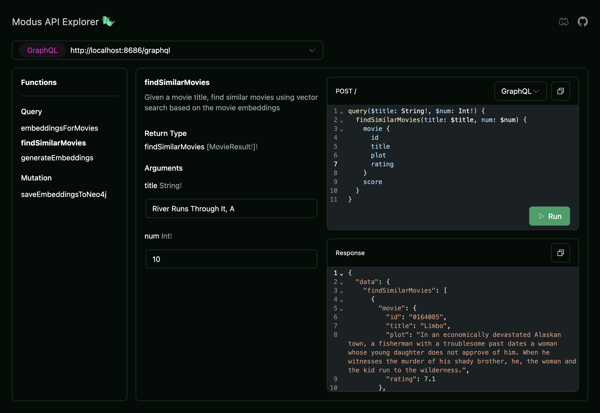

# Neo4j Modus Starter Kit

A full stack app showing how to use the Neo4j knowledge graph with Modus and AI models.

To get started:

- Create a free [Neo4j Sandbox instance](https://sandbox.neo4j.com)

- Add your Neo4j credentials to `.env`

```env
MODUS_NEO4J_NEO4J_URI=<YOUR_NEO4J_CONNECTION_URI_HERE>
MODUS_NEO4J_USERNAME=<YOUR_NEO4J_USER_HERE>
MODUS_NEO4J_PASSWORD=<YOUR_NEO4J_PASSWORD_HERE>
```

- Install the Modus CLI

```bash
npm i -g @hypermode/modus-cli
```

- Install the Hyp CLI and sign in to Hypermode

By default we can take advantage of shared model hosting on Hypermode

```bash
npm i -g @hypermode/hyp-cli
```

- Start your Modus app

```shell
modus dev
```

This will start your Modus app locally

- Open the API Explorer

Open `http://localhost:8686/graphql` in a web browser

First, run the `saveEmbeddingsToNeo4j` mutation to generate movie embeddings and save to Neo4j.

```GraphQL
mutation {
  saveEmbeddingsToNeo4j
}
```

Then search for movies using the `findSimilarMovies` Query field

```GraphQL
query($title: String!, $num: Int!) {
  findSimilarMovies(title: $title, num: $num) {
    movie {
      id
      title
      plot
      rating
    }
    score
  }
}
```


